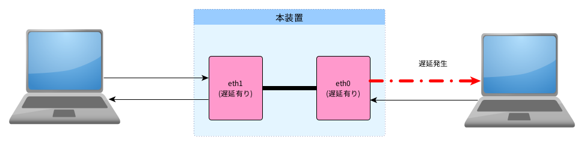
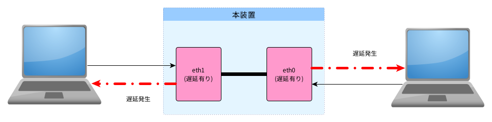

.. _filter:

フィルター設定
=====================

フィルターの適用範囲
---------------------------

フィルター設定はネットワークデバイスの出力(送信側)に対して適用されます。

例えば、遅延オプションを片方のデバイスにしか設定しない場合、一方向のパケットにのみ遅延が発生し、
逆方向のパケットには遅延が発生しません。

   片方向の遅延

そのため、双方向に遅延を発生させる場合は、両デバイスに対して同じフィルター設定を行って下さい。

   双方向の遅延

.. raw:: latex

   \clearpage

編集
---------------

編集コマンド
------------------

フィルター・オプションは一旦編集バッファに格納され、 `edit` コマンドで編集中の内容を確認できます。
`update` コマンドを実行するとフィルター・設定が変更されます。
また、 `reset` コマンドで解除されます。

.. figure:: _static/filter_command.png
   :width: 70%

   編集コマンド

(1) edit
^^^^^^^^^^^^^^^^^^

編集中でフィルター未適用の内容を表示します。

.. figure:: _static/edit.png
   :width: 95%

   edit コマンド

.. raw:: latex

   \clearpage

(2) update
^^^^^^^^^^^^^^^^^^^^^^^^^

編集中の内容をフィルターに適用します。

.. figure:: _static/update.png
   :width: 95%

   update コマンド

上記の例では、帯域が64Kpbs(=512Kbit/second)に設定されています。

(3) reset
^^^^^^^^^^^^^^^^^^^^^^^^^^

適用済み、及び、編集中のフィルタ設定をリセットします。

.. figure:: _static/reset.png
   :width: 95%

   reset コマンド

.. raw:: latex

   \clearpage

フィルター・オプション
---------------------------

フィルター・オプションを入力すると一旦編集バッファに格納されます。
`update` コマンドを実行するとフィルター設定に反映されます。（前節参照）

(1) delay: 遅延
^^^^^^^^^^^^^^^^^^^

パケットの遅延設定を行います。

書式::

  > delay 遅延時間   {ばらつき}   {発生率(%)}

..

   .. table:: delayオプションの引数
      :widths: 20, 10, 60

      =====================  =========  ==============================================
      引数                      省略       値
      =====================  =========  ==============================================
      遅延時間                 必須      単位: s:秒 / ms:ミリ秒 / us:マイクロ秒
      ばらつき時間             可        単位: s:秒 / ms:ミリ秒 / us:マイクロ秒
      ばらつき発生率           可        単位: %
      =====================  =========  ==============================================

実行例:

a. 100msecの遅延を発生させる。

  .. code-block:: shell

    > delay 100ms

b. 100msec±20msecの遅延を発生させる。

  .. code-block:: shell

    > delay 100ms  20ms

c. 100msec±20msecの遅延を50%、残りは100msecの遅延を発生させる。

  .. code-block:: shell

    > delay 100ms  20ms  50%

.. raw:: latex

   \clearpage

注意::

pingコマンドのようにパケット往復が発生する通信の場合、フィルターの適用範囲によって全体の遅延時間に違いが発生します。

a. 双方向に遅延を設定した場合

   .. code-block:: shell

      a > delay 100ms

   往復で200msの遅延が発生します。

   .. figure:: _static/filter_delay_both-2.png
      :width: 60%

      両方向の遅延

   往復で100msにする場合は、50msの遅延設定にして下さい。

b. 片方向に遅延を設定した場合

   .. code-block:: shell

      1 > delay 100ms

   片方向のみで100msの遅延が発生します。

   .. figure:: _static/filter_delay_one-2.png
      :width: 60%

      片方向の遅延

.. raw:: latex

   \clearpage

通信量が偏っている場合::

サーバからのダウンロードのように片側の通信量が大きい場合はフィルターの設定方向に注意して下さい。

   .. figure:: _static/filter_download.png
      :width: 100%

      通信量が偏っている例

.. raw:: latex

   \clearpage

(2) loss: 損失 (パケットロス)
^^^^^^^^^^^^^^^^^^^^^^^^^^^^^^^^

パケットロスを発生させます。

書式::

  > loss  損失率(%)

..

   .. table:: lossオプションの引数
      :widths: 20, 10, 60

      =====================  =========  ==============================================
      引数                    省略        値
      =====================  =========  ==============================================
      損失率                  必須        単位: %
      =====================  =========  ==============================================

実行例:

a. 10% の確率でパケットロスする。

  .. code-block:: shell

      > loss 10%

.. note::

   遅延時間と同様にフィルターの適用範囲に注意して下さい。

.. raw:: latex

   \clearpage

(3) duplicate: 重複
^^^^^^^^^^^^^^^^^^^^^^^^^^^^^

パケットの重複を発生させます。

書式::

  > duplicate  発生率(%)

..

   .. table:: duplicateオプションの引数
      :widths: 20, 10, 60

      =====================  =========  ==============================================
      引数                    省略        値
      =====================  =========  ==============================================
      発生率                  必須        単位: %
      =====================  =========  ==============================================

実行例:

a. 10% の確率でパケットを重複させる。

   .. code-block:: shell

      > duplicate 10%

.. note::

   遅延時間と同様にフィルターの適用範囲に注意して下さい。

.. raw:: latex

   \clearpage

(4) corrupt: 破損
^^^^^^^^^^^^^^^^^^^^^^^^^^^^^

パケットのデータを書き換えます (ランダムな１bitを反転)

書式::

  > corrupt  発生率(%)

..

   .. table:: corruptオプションの引数
      :widths: 20, 10, 60

      =====================  =========  ==============================================
      引数                    省略        値
      =====================  =========  ==============================================
      発生率                  必須        単位: %
      =====================  =========  ==============================================

実行例:

a. 0.1% の確率でパケットを書き換える。

   .. code-block:: shell

      > corrupt 0.1%

.. note::

   1. 遅延時間と同様にフィルターの適用範囲に注意して下さい。

   2. TCP/IPパケットの場合はプロトコル・スタックでCRCチェックで誤りを検出してパケットは破棄されます。
      UDPパケットでチェックサムを無効にしている場合は上位層で誤り検出が必要です。

.. raw:: latex

   \clearpage

(5) reorder: 順序変更
^^^^^^^^^^^^^^^^^^^^^^^^^^^^^

パケットの到着順序を変更します。

書式::

  > reorder  発生率(%)

..

   .. table:: reorderオプションの引数
      :widths: 20, 10, 60

      =====================  =========  ==============================================
      引数                    省略        値
      =====================  =========  ==============================================
      発生率                  必須        単位: %
      =====================  =========  ==============================================

実行例:

a. 10% の確率でパケットの到達順序を変更する。

   .. code-block:: shell

      > reorder 10%

.. note::

   遅延時間と同様にフィルターの適用範囲に注意して下さい。

.. raw:: latex

   \clearpage

(6) rate: 帯域制御
^^^^^^^^^^^^^^^^^^^^^^^^^^^^^

書式::

  > rate  帯域

..

   .. table:: rateオプションの引数
      :widths: 20, 10, 60

      =====================  =========  ==============================================
      引数                    省略        値
      =====================  =========  ==============================================
       帯域                  必須        単位
      =====================  =========  ==============================================

   .. table:: 単位
      :widths: 10, 30

      ===========   ===========================
      単位           意味
      ===========   ===========================
      bps            byte/second
      bit            bit/second
      指定なし       bit/second
      K / k          Killo (1,000)
      M / m          Mega (1,000,000)
      G / g          Giga (1,000,000,000)
      ===========   ===========================

   .. table:: 設定例
      :widths: 10, 30

      ========   =========================
      例          解釈
      ========   =========================
      1000       1K bit/second
      1K         1K bit/second
      1Kbit      1K bit/second
      1Kbps      1K byte/second
      ========   =========================

実行例:

   .. code-block:: shell

      > rate 64kbps

.. note::

   遅延時間と同様にフィルターの適用範囲に注意して下さい。

.. raw:: latex

   \clearpage