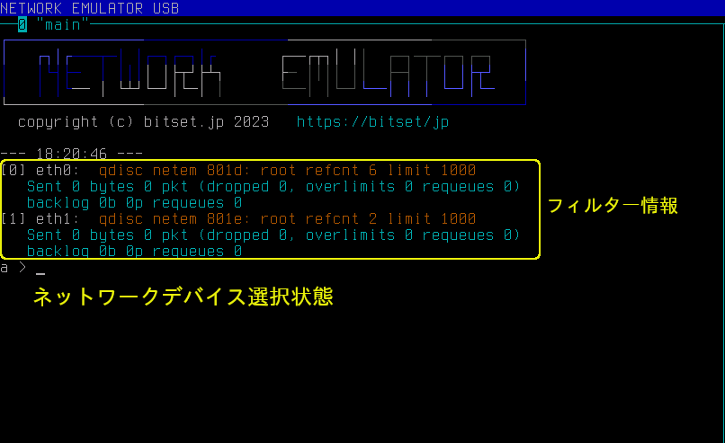
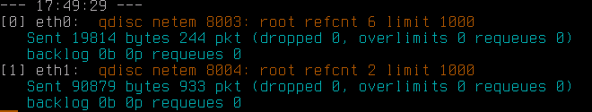
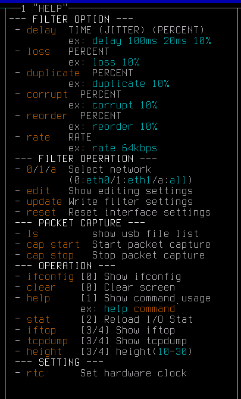
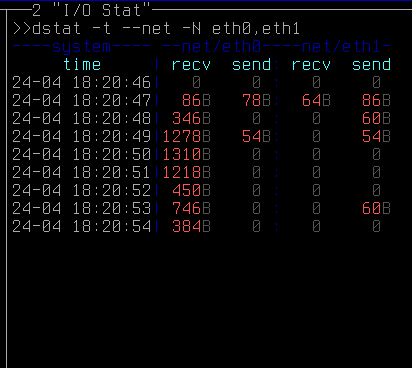

操作説明
===========


画面構成
--------------

本装置の実行画面です。

.. figure:: _static/ss_overview.png
   :width: 95%

   実行画面


画面は次の５つに分割されます。

.. table:: 画面構成
   :widths: 20, 20, 70

   ===============  ==============  =============================================================
   画面タイトル      本書での名称       機能
   ===============  ==============  =============================================================
   0 main            0:メイン画面      コマンド入力画面です。
   1 HELP            1:ヘルプ画面      ヘルプを表示します。
   2 I/O Stat        2:通信量画面      毎秒の通信量を表示します。
   3 eth0            3:eth0画面        eth0 の通信状態を表示します。(iftop / tcpdump 切り替え)
   4 eth1            4:eth1画面        eth1 の通信状態を表示します。(iftop / tcpdump 切り替え)
   ===============  ==============  =============================================================

.. raw:: latex

   \clearpage

メイン画面 (0:main)
--------------------------

コマンド操作を行う画面です。




   メイン画面


キー入力は全てこの画面で行い、以下のことができます。

#. ネットワークデバイスの選択
#. フィルターの設定
#. パケットキャプチャ
#. システム設定
#. ヘルプ表示の指示


.. raw:: latex

   \clearpage


フィルター情報表示
^^^^^^^^^^^^^^^^^^^^^^^^^^^^^^^^^^^^^^

``ENTER`` を押すか、コマンドを実行するたびに最新のフィルター情報を表示します。



   フィルター設定情報

* 1行目 ( "[0] eth0:... ", "[1] eth1:... " )

   フィルター設定です。フィルターの詳細は :ref:`filter` を参照願います。

* 2-3行目 (青文字)

   ネットワークデバイス毎の通信統計です。

   .. table:: 表示項目
      :widths: 10, 40

      ===============    ==========================================
       項目                意味
      ===============    ==========================================
      Sent                送信バイト数、パケット数
      dropped             破棄
      overlimit           キューが一杯になった回数
      requeues            再送のためのキューイング
      backlog             T.B.D
      ===============    ==========================================


.. raw:: latex

   \clearpage


ネットワークデバイスの選択
^^^^^^^^^^^^^^^^^^^^^^^^^^^^^^^^^^^^^^^^^

プロンプトのネットワークデバイスの選択状態を表します。

.. table:: プロンプト
   :widths: 10, 40

   ============  ==================================
   プロンプト      選択状態
   ============  ==================================
   ``0 >``         eth0 を選択
   ``1 >``         eth1 を選択
   ``a >``         両方(eth0, eth1)を選択
   ============  ==================================

デバイス選択コマンド( ``0`` / ``1`` / ``a`` ) で切り替えることができます。


0: eth0を選択::

   a > 0 [ENTER]
   0 >

1: eth1を選択::

   0 > 1 [ENTER]
   1 >

a: 両方(eth0, eth1)を選択::

   0 > a [ENTER]
   a >


.. raw:: latex

   \clearpage

ヘルプ画面 (1:HELP)
------------------------------

コマンドのヘルプを表示します。




   ヘルプ画面 (コマンド一覧)

「0:メイン画面」で ``help コマンド名`` と入力すると、そのコマンドのヘルプを表示します。

.. code:: text

   a > help rate

.. figure:: _static/ss_1_help_rate.png
   :scale: 35

   ヘルプ画面 (help rate)

.. note::

   使用可能なコマンドは :ref:`command_list` を参照してください。


.. raw:: latex

   \clearpage

通信量画面 (2:I/O Stat)
--------------------------------------

ネットワークデバイス (eth0, eth1)の各送受信量を１秒毎に更新します。



   通信量画面


時刻, eth0(受信, 送信), eth1(受信, 送信) の並びで表示します。
また、通信量によって数字の色が変化します。

.. table:: 通信量の色
   :widths: 10, 80

   ======   ==================
   色        単位
   ======   ==================
   赤        Byte
   黄        Kbyte
   緑        Mbyte
   ======   ==================


.. note:: 

   起動時にネットワークデバイスが非アクティブ(=接続されていない)場合、起動後にネットワークに接続しても通信量が表示されません。
   その際は、「0:メイン画面」で ``stat`` コマンドを実行して下さい。


.. raw:: latex

   \clearpage

eth0画面(3:eth0) / eth1画面 (4:eth1)
-------------------------------------------------

ネットワークデバイスの通信状態(iftop, tcpdump のいずれか)を表示します。


* iftop

  TCPコネクション単位での帯域を表示します。

* tcpdump

  ネットワークパケットを表示します。


表示切り替え
^^^^^^^^^^^^^^^^^^^^^^^^^^^^^^^^^

「0:メイン画面」からコマンド入力で表示を切り替えます。


(1) iftop
```````````````````````
   .. figure:: _static/ss_3-4_eth.png
      :width: 100%

      iftopのみ

   手順::

      0 > a        ... 両方のデバイスを選択
      a > iftop    ... 表示切り替え


.. raw:: latex

   \clearpage


(2) tcpdump
````````````````
   .. figure:: _static/ss_3-4_eth_tcpdump.png
      :width: 100%

      tcpdumpのみ

   手順::

      0 > a          ... 両方のデバイスを選択
      a > tcpdump    ... 表示切り替え

(3) 混在
`````````````````````````````````````````````

左(eth0), 右(eth1) で異なる表示にすることも可能です。


   .. figure:: _static/ss_3-4_eth_mix.png
      :width: 100%

      iftop(左:eth0), tcpdump(右:eth1)


   手順::

      a > 0          ... eth0 を選択
      0 > iftop      ... eth0 の表示切り替え
      0 > 1          ... eth1 を選択
      1 > tcpdump    ... eth1 の表示切り替え


.. raw:: latex

   \clearpage


表示サイズ変更
^^^^^^^^^^^^^^^^^^^^^^^^^^

「0:メイン画面」から ``height`` コマンドで表示サイズ(行数) を変更できます。

手順::

   0 > height 20     ... 10 - 35 に範囲で指定

.. note:: 

   デバイスの選択状態に関係なく、画面3,4 同時に変更されます。


