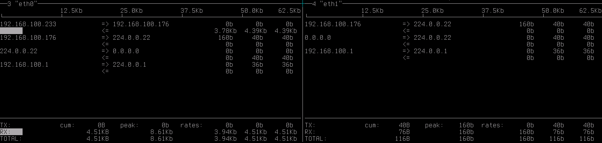

一般操作
============

ifconfig: ネットワーク設定表示
-------------------------------------------

選択中のネットワークデバイス(eth0, eth1)の設定を表示します。

.. table:: ifconfigで表示するデバイス
   :widths: 10, 40

   ===========   ======================================
   カーソル       表示内容
   ===========   ======================================
   ``0 >``        eth0のみ表示
   ``1 >``        eth1のみ表示
   ``a >``        eth0, eth1 両方を表示
   ===========   ======================================

書式::

   > ifconfig

実行例:

   .. figure:: _static/ss_ifconfig.png
      :width: 95%

      ifconfig 出力例

clear: メイン画面のクリア
----------------------------------

「0:メイン画面」を表示クリアします。

書式::

   > clear

help: ヘルプ表示
--------------------

ヘルプ表示します。ヘルプは 「1:ヘルプ画面」に表示します。

書式::

   > help {コマンド名}

実行例::

   > help rate

.. figure:: _static/ss_1_help_rate.png
   :scale: 35

   ヘルプ画面 (help rate)

stat: 通信量画面の再起動
----------------------------

「2:通信量画面」を再起動します。

書式::

   > stat

.. note:: 

   起動時にネットワークデバイスが非アクティブ(=接続されていない)場合、起動後にネットワークに接続しても通信量が表示されません。
   その際は、本コマンドを実行して下さい。

.. raw:: latex

   \clearpage

iftop
----------------------

「3:eth0 画面」,「4:eth1 画面」の表示を iftopコマンドに切り替えます。

書式::

   > iftop

   iftop

tcpdump
---------------------

「3:eth0 画面」,「4:eth1 画面」の表示を tcpdumpコマンドに切り替えます。

選択中のデバイスのみ表示を切り替えます。

書式::

   > tcpdump

.. figure:: _static/ss_3-4_eth_tcpdump.png
   :width: 100%

   tcpdump

.. raw:: latex

   \clearpage

height
-------------------

「3:eth0 画面」,「4:eth1 画面」の表示行数を変更します。

選択中のデバイスのみ表示を切り替えます。

書式::

   > hegith 行数

..

   .. table:: height コマンドの引数
      :widths: 20, 10, 60

      =============  =========  =======================
      引数            省略       値
      =============  =========  =======================
      行数            必須        10 - 35
      =============  =========  =======================

実行例::

  > height 20

.. raw:: latex

   \clearpage