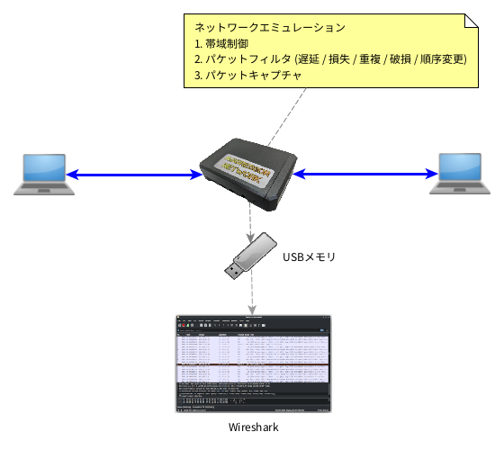
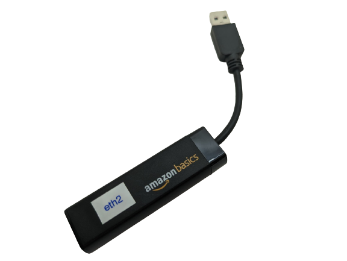
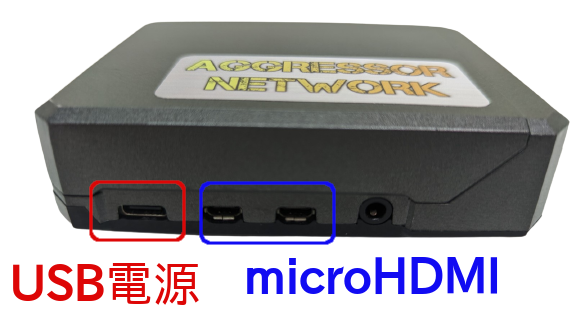

概要
======

本製品はさまざまなネットワーク障害を発生させるネットワークエミュレータで、帯域制御、パケットフィルター(遅延/損失/重複/破損/順序変更)を発生させることができます。
またUSBメモリにパケットキャプチャ結果を保存可能です。



      使用イメージ


.. raw:: latex

   \clearpage


仕様
-------

.. table:: ネットワーク
  :widths: 10, 40

  ==============  ===================================
  ネットワーク     有線
  ポート数         2ポート (本体, USBアダプタ)
  最大速度         1Gbps
  IPアドレス       使用しません
  ==============  ===================================

.. note:: 

   本製品はIPアドレスを使用せず、ネットワークHUBと同様にパケットを転送します。


.. table:: パケットフィルター
  :widths: 10, 40

  ==============  =============================================
  遅延            遅延時間を指定。ジッター(ゆらぎ)指定可能
  損失            発生率を指定
  重複            発生率を指定
  破損            発生率を指定
  順序変更        発生率を指定
  帯域制御        通信速度を指定 (bps - Gbps)
  ==============  =============================================

.. table:: パケットキャプチャ
  :widths: 10, 40

  ================  ===================================
  データ保存形式    PCAP ... Wireshark で表示可能
  データ保存先      USBメモリ
  USBメモリ         FATフォーマット
  ================  ===================================

.. table:: その他
  :widths: 10, 40

  ================  ===================================
  表示               HDMIモニタ、解像度:フルHD
  入力デバイス       USBキーボード (US/JP切替可)
  電源               USB Type-C 5V/3A以上
  RTC                内蔵 (交換用電池：CR1225)
  ================  ===================================


製品構成
-----------


.. |main| image:: _static/main.png
   :align: bottom



.. |hdmi| image:: _static/hdmi-adapter.png
   :align: bottom

.. |power| image:: _static/power.png
   :align: bottom

.. table:: 本体に含まれるもの
   :widths: 20, 20, 20

   ==================================  ==============  ================================
   機材                                  写真           補足
   ==================================  ==============  ================================
   1. 本体                              |main|          - Ethernet Gbit Ethernet x1
                                                        - USB3 x2
                                                        - USB2 x2
                                                        - microHDMI x2
                                                        - USB Type-C (電源専用) x1
                                                        - RTC内蔵
                                                         
   2. USBネットワークアダプタ           |eth|           - USB3.0 Gbit Ethernt対応
   3. microHDMI - HDMI変換アダプタ      |hdmi|
   4. USB電源                           |power|         - USB Type-C 5V/3A以上
   ==================================  ==============  ================================

.. raw:: latex

   \clearpage


ポートの構成
^^^^^^^^^^^^^^^^

(1) USB, Ethernet
`````````````````````````````
青いUSBポートが USB3, 黒いポートが USB2 です。

.. figure:: _static/side-usb.png
   :width: 45%

   Ethernt, USB2, USB3, Ethernet

.. table:: Ethernetポートのデバイス名
   :widths: 20, 40

   =========================  ================================
   ポート                      イーサネットデバイス名
   =========================  ================================
   Ethernetポート              eth0
   USBネットワークアダプタ     eth1
   =========================  ================================


.. table:: USBポートの用途
   :widths: 20, 40

   =================  ===========================================
   ポート              用途
   =================  ===========================================
   USB3  (青)          USBネットワークアダプタ

                       USBメモリ
   USB2  (黒)          キーボード
   =================  ===========================================


(2) 電源、HDMI
```````````````````````
microHDMIは2ポートありますが、どちらに接続しても構いません。



   USB電源, microHDMI


.. raw:: latex

   \clearpage

別途、用意する機材
---------------------

以下の機材は製品に含まれないので、お客様でご用意ください。


.. table:: お客様でご用意して頂くもの
   :widths: 50, 10, 60

   =====================  =========  ==============================================
   機材                     数量       仕様
   =====================  =========  ==============================================
   キーボード                1          USB, 英語 or 日本語
   ディスプレイ              1          解像度:フルHD, HDMI対応
   Ethernetケーブル          2
   USBメモリ                 1          USB3.0対応が望ましい

                                        パケットキャプチャする場合のみ必要
   =====================  =========  ==============================================

.. note::

   上記以外に、本機の両ネットワークに接続するネットワーク機器が必要です。

