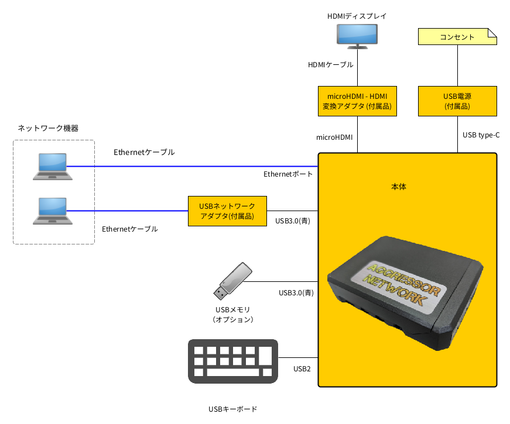

セットアップ
===============

周辺機器の接続から起動・終了までの手順を説明します。

本体と各機器は以下のように接続します。

   接続図

- ネットワーク機器はPCを直接接続して、HUB経由で接続しても構いません。

.. raw:: latex

   \clearpage

実際の接続例です。

.. figure:: _static/connect-example.jpg
   :width: 80%

   接続例

.. raw:: latex

   \clearpage

接続手順
---------

本装置に以下のように各ケーブルを接続します。

.. figure:: _static/all-connect.png
   :width: 45%

   本体への接続

#. ネットワークケーブルの接続: eth0

   本体のネットワークポートにEthernetケーブルを接続します。

#. USBネットワークアダプタの接続: eth1

   USB3(青) のポートに USBネットワークアダプタを接続します。

   また、アダプタの先にEhternetケーブルを接続します。

#. キーボードの接続

   USB2(黒) のポートに キーボードを接続します。

#. ディスプレイの接続

   - 付属のmicroHDMI・HDMI変換アダプタを使ってHDMIディスプレイを接続します。
   - どちらのポートに接続しても大丈夫です。

4. 電源の接続

   USB Type-C ポートにUSB電源を接続します。

.. raw:: latex

   \clearpage

起動
---------

1. USB電源のスイッチをONにします。

2. ディスプレイに起動画面が表示されるまで待ちます。

終了
------

1. USB電源のスイッチをOFFにします。

.. note::

  本装置は電源ブチ切り対応なので、シャットダウン等の操作は不要です。
